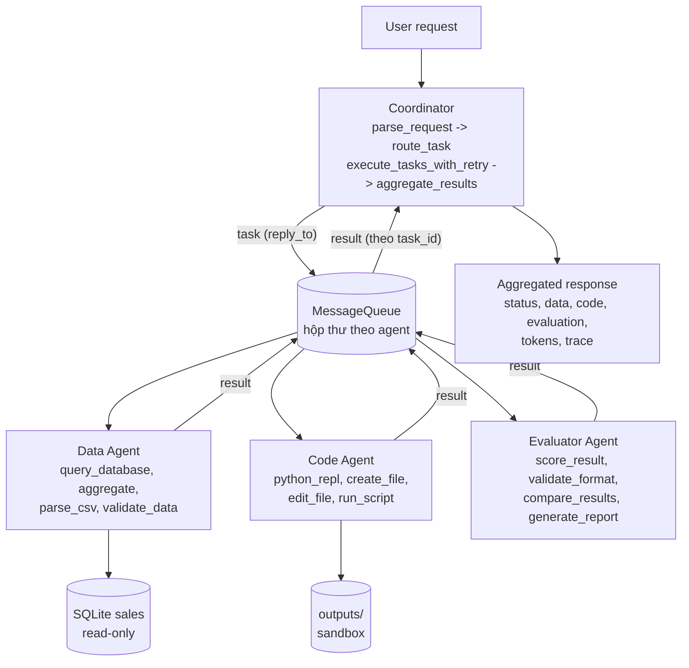

# Báo cáo: Hệ thống đa tác tử Coordinator–Workers

> Báo cáo theo hướng dẫn các Phần 1–6 (coordinator, worker, tool, test, benchmark). Báo cáo thí nghiệm của lab
> Deep Agents (baseline / subagents / skills-auto, theo `REPORT_TEMPLATE.md` và `RUBRIC.md`) nằm ở `report/REPORT.md`.

- Sinh viên: Nguy Khắc Phi Long, 2A202602532
- Mô hình: `openai:gpt-4.1-mini` (`LAB_MODEL`), `LAB_TEMPERATURE=0`; Python 3.11, macOS (chạy trực tiếp)
- Mã nguồn: `src/coordinator.py`, `src/agents/`, `src/communication/`, `src/tools/`, `src/system.py`;
  test: `tests_mas/`; script: `scripts_mas/`

## 1. Tổng quan bài lab

Hệ thống điều phối đa tác tử xử lý các yêu cầu phân tích doanh số cần nhiều tác tử chuyên môn phối hợp:

- **Coordinator (supervisor/router):** nhận yêu cầu, phân loại, định tuyến tới worker, chờ kết quả có timeout, retry/fallback, gộp kết quả.
- **Data Agent:** trả lời câu hỏi dữ liệu bằng SQL chỉ-đọc trên CSDL SQLite `sales` (600 đơn hàng năm 2026, sinh xác định bằng seed).
- **Code Agent:** viết và chạy mã Python (sandbox tiến trình con), tạo tệp (script, biểu đồ SVG).
- **Evaluator Agent:** chấm kết quả theo 4 tiêu chí có trọng số và đưa phản hồi dạng JSON.

Mục tiêu: hệ thống ổn định (không sập khi worker lỗi hoặc chậm), an toàn (SQL chỉ-đọc, sandbox, chặn path traversal, không lộ khóa API), đo được (log JSON, token, độ trễ) và kiểm thử được ngoại tuyến (mô hình giả, 0 token).

Phạm vi: một tiến trình, hàng đợi trong bộ nhớ, một mô hình LLM dùng chung cho mọi tác tử.

**Ba câu hỏi Phần 1.**

1. *Có bao nhiêu agent, mỗi agent làm gì?* Có 4 agent: Coordinator (điều phối, không có tool) và 3 worker (Data: 4 tool dữ liệu; Code: 4 tool mã/tệp; Evaluator: 4 tool chấm điểm). Mỗi worker có system prompt và bộ tool riêng theo chuyên môn.
2. *Coordinator giao tiếp với worker bằng cách nào?* Qua `MessageQueue` (asyncio, mỗi agent một hộp thư). Coordinator gửi thông điệp `task` kèm `reply_to` là một hộp thư trả lời riêng cho task (mẫu RPC). Worker nhận task, chạy vòng lặp LLM↔tool, rồi gửi thông điệp `result` về `reply_to`. Coordinator chờ có timeout, retry hoặc chuyển worker dự phòng nếu lỗi. Kết quả của giai đoạn trước được chuyển sang giai đoạn sau qua `parameters.previous_results` (handoff qua shared state).
3. *Tool nào được chia sẻ?* Tool không chia sẻ giữa các worker (nguyên tắc đặc quyền tối thiểu: Data Agent không chạy được mã, Code Agent không truy vấn được CSDL). Hạ tầng thì dùng chung: lớp `BaseTool` (validate → run → log, lỗi trả về dạng dữ liệu), `safe_path`, logger JSON, `MessageQueue`, bộ đếm token trong `BaseAgent`, và cùng một mô hình LLM.

## 2. Kiến trúc



**Luồng một yêu cầu** (ví dụ "Analyze Q3 revenue by region, create a chart and evaluate"):

```text
parse_request  -> task_types = [data_analysis, code_generation, evaluation], parameters = {quarter: 3}
route_task     -> data_agent, code_agent, evaluator_agent
stage 0 (song song trong giai đoạn): data_agent       -> "Q3 revenue: ..."   ┐ shared state
stage 1: code_agent (previous_results = data)          -> "chart.svg ..."    ┤ (handoff)
stage 2: evaluator_agent (previous_results = data+code)-> {"score": ..}      ┘
aggregate_results -> {status, data, code, evaluation, errors, tokens, trace, seconds}
```

Các worker trong cùng một giai đoạn chạy song song (`asyncio.gather`). Các giai đoạn chạy tuần tự vì có phụ thuộc dữ liệu: biểu đồ cần số liệu, đánh giá cần kết quả.

**Giao thức thông điệp** (mỗi thông điệp được gắn `from`, `to`, `id`, `timestamp` và ghi vào `logs/communication.log`):

```json
{"type": "task", "task_id": "data_agent-3f2a9c1d", "reply_to": "coordinator/data_agent-3f2a9c1d",
 "content": "User request: ...\nYour part: ...", "parameters": {"quarter": 3, "previous_results": {}},
 "from": "coordinator", "to": "data_agent", "id": "<uuid4>", "timestamp": "2026-10-06T..."}
{"type": "result", "task_id": "data_agent-3f2a9c1d",
 "result": {"status": "success|error|timeout", "worker": "data_agent", "type": "data", "result": "...",
            "metadata": {"tools_used": ["query_database"], "iterations": 2, "tokens": {...}, "seconds": 3.1}},
 "from": "data_agent", "to": "coordinator/data_agent-3f2a9c1d", "id": "<uuid4>", "timestamp": "..."}
```

**Guardrail:**

| Cơ chế | Giá trị | Vị trí |
|---|---|---|
| Số vòng lặp LLM↔tool tối đa của worker | 6 | `BaseWorker.max_iterations` |
| Timeout mỗi task | 120 s | `Coordinator.timeout` |
| Retry task lỗi/timeout | 1 lần | `Coordinator.max_retries` |
| Worker dự phòng | tùy cấu hình | `Coordinator.fallbacks` |
| Số task tối đa mỗi lô | 10 | `Coordinator.max_tasks` |
| Kích thước hộp thư | 100 | `MessageQueue.maxsize` |
| Độ dài yêu cầu tối đa | 5000 ký tự | `MAX_REQUEST_CHARS` |
| Timeout và giới hạn CPU của mã | 30 s | `PythonREPLTool`, `RunScriptTool` |
| Số dòng SQL tối đa / trả về cho LLM | 1000 / 100 | `QueryDatabaseTool` |
| Độ dài kết quả tool đưa lại cho LLM | 6000 ký tự | `BaseWorker.max_tool_output` |

## 3. Chi tiết cài đặt (quyết định và đánh đổi)

| # | Quyết định | Lý do | Đánh đổi |
|---|---|---|---|
| 1 | **asyncio + `asyncio.to_thread`** cho worker | Thời gian chủ yếu là chờ I/O (API LLM), nên các worker cùng giai đoạn chạy song song mà không cần đa tiến trình | Một thread bị timeout không hủy cưỡng bức được: nó chạy nốt và kết quả bị bỏ (vẫn tốn token) |
| 2 | **MessageQueue trong bộ nhớ** (`asyncio.Queue`) với **hộp thư `reply_to` riêng cho mỗi task** (mẫu RPC) | Đơn giản, đủ cho phạm vi lab. Phiên bản đầu dùng chung hộp thư coordinator thì `test_concurrent_requests` thất bại (5/10): các request song song "rút" mất reply của nhau | Không bền vững, chỉ trong một tiến trình |
| 3 | **Giai đoạn tuần tự data → code → evaluator** với handoff qua `previous_results` | Biểu đồ cần số liệu, đánh giá cần kết quả; truyền qua parameters để worker không phải tự đi tìm | Tổng độ trễ là tổng các giai đoạn; chỉ song song được trong cùng một giai đoạn |
| 4 | **`parse_request` theo luật từ khóa**, chỉ gọi LLM khi không khớp; cache theo câu đã chuẩn hóa | Coordinator là điểm nghẽn: luật mất 0 token và khoảng 0 ms; benchmark: 9/9 request phân loại bằng luật | Luật có thể phân loại sai câu lạ (ví dụ "report" luôn kéo theo Code Agent) |
| 5 | **Tool trả lỗi dạng dữ liệu** (`{"status": "error"}`), không ném | LLM đọc được lỗi và tự sửa ở vòng sau (Code Agent sửa script lỗi rồi chạy lại) | Phải đặt `max_iterations` để chặn vòng sửa lỗi vô hạn |
| 6 | **SQL ba lớp bảo vệ**: từ khóa (`\b`), một câu lệnh, mở SQLite `mode=ro`; bọc `SELECT * FROM (q) LIMIT n` | Lớp read-only vẫn chặn được thay đổi dữ liệu nếu lớp từ khóa bị vượt qua; regex `\b` tránh chặn nhầm cột như `updated_at` (cách `in` của hướng dẫn mẫu sẽ chặn nhầm) | Chỉ hỗ trợ SQLite |
| 7 | **Sandbox mã bằng tiến trình con** (`python -I`), env tối thiểu (không kế thừa khóa API), cwd = `outputs/`, timeout + giới hạn CPU, chặn import nguy hiểm | `exec()` trong tiến trình như hướng dẫn mẫu dùng chung bộ nhớ và môi trường (lộ `OPENAI_API_KEY`), không timeout được | Không giữ biến giữa các lần gọi; chưa phải cách ly mức hệ điều hành (nên dùng Docker) |
| 8 | **Một kết nối SQLite được cache** + `threading.Lock` | Không mở lại kết nối mỗi truy vấn; worker chạy trong thread pool | Truy vấn đồng thời bị tuần tự hóa |
| 9 | **Chỉ dùng thư viện chuẩn** (không pandas/matplotlib), biểu đồ bằng SVG | Không đổi `pyproject.toml` của lab | Code Agent phải tự viết SVG |

**Khó khăn đã gặp và cách xử lý (đều phát hiện bằng test):**

1. *Race reply giữa các request đồng thời:* chuyển sang hộp thư `reply_to` riêng cho mỗi task.
2. *`asyncio.Queue` gắn với event loop đầu tiên:* gọi `asyncio.run` nhiều lần làm lỗi. Đã thêm `_ensure_loop()` để tạo lại hộp thư (giữ thông điệp đang chờ) khi loop đổi.
3. *Giới hạn CPU sai trên macOS:* tiến trình con kế thừa thời gian CPU của tiến trình cha, nên giới hạn 3 s giết vòng lặp sau 0,15 s. Một script hợp lệ cũng có thể bị giết oan. Đã chuyển sang giới hạn tương đối (CPU đã dùng + 3 s), đo lại thì bị dừng sau 2,4 s.
4. *Tiến trình con bị giới hạn CPU giết không có trường `error`:* đã chuẩn hóa thông báo lỗi.

## 4. Kết quả test

Tất cả chạy ngoại tuyến bằng mô hình giả `ScriptedChatModel` (0 token): `pytest tests_mas/ -v` cho **32/32 passed** (3,1 s). Bộ test của lab `pytest tests/` cũng **32/32 passed**.

| Tệp | Loại | Số test | Nội dung |
|---|---|---|---|
| `test_02_coordinator.py` | unit | 10/10 | init, parse (luật, tham số, ưu tiên, cache, chỉ gọi LLM khi luật không khớp), route, execute song song qua queue, aggregate (success/partial/error), timeout, retry, fallback, input không hợp lệ, vượt `max_tasks` |
| `test_03_workers.py` | unit + giao tiếp | 9/9 | Data/Code/Evaluator agent với tool thật, guardrail `max_iterations`, tool không tồn tại, mô hình lỗi, MessageQueue (gửi/nhận/log/timeout/chưa đăng ký/đầy/loop mới), `handle_next` trả lời đúng người gửi |
| `test_04_tools.py` | unit | 7/7 | SQL (đúng giá trị so với SQLite trực tiếp; chặn DROP/DELETE/UPDATE/PRAGMA/đa câu lệnh; dữ liệu còn nguyên), REPL (chặn import, timeout, **không lộ khóa API**), path traversal, edit/run script, scoring, validation, comparison, report, aggregation, data quality, CSV |
| `test_05_integration.py` | integration + e2e | 6/6 | coordinator ↔ worker ↔ tool với handoff (Code Agent nhận số liệu của Data Agent), pipeline đủ 3 giai đoạn + đếm token, kết quả partial khi một worker lỗi, độ trễ, 10 request đồng thời (10/10 thành công) |

| Kịch bản lỗi | Test | Kết quả |
|---|---|---|
| Worker treo 1 s, timeout 0,2 s | `test_worker_timeout_is_reported_not_raised` | trả về `status=timeout`, không ném lỗi, `active_tasks` được dọn |
| Worker lỗi lần đầu | `test_worker_error_is_retried` | thành công ở lần 2 (`attempts=2`) |
| Worker ném ngoại lệ | `test_worker_exception_falls_back_to_other_worker` | chuyển sang worker dự phòng (`fallback_from`) |
| SQL injection `SELECT ...; DROP TABLE` | `test_query_database_tool` | bị chặn ("only one statement is allowed") |
| `../evil.txt`, `/etc/passwd` | `test_create_file_tool` | bị chặn, không có tệp nào ngoài sandbox |
| LLM lặp gọi tool mãi | `test_max_iterations_guardrail` | dừng sau 3 vòng, `status=error` |

Script kiểm tra độc lập (0 token): `scripts_mas/test_coordinator_standalone.py` cho 3/3 (2 worker song song xong trong 0,21 s so với 0,40 s nếu tuần tự; timeout → retry → fallback). `scripts_mas/test_tool_integration.py` cho 3/3 (doanh thu Q3 theo vùng: North 98378.20, West 80582.97, South 69371.57, East 57550.00; tạo `sales_chart.svg`; chấm 93,5/100).

## 5. Phân tích hiệu suất

Benchmark mô hình thật `gpt-4.1-mini`: `python scripts_mas/benchmark.py --iterations 3`, kết quả trong `benchmark_results.json`. Có 3 kịch bản × 3 lần, tổng 9 request. Độ chính xác của Data Agent được chấm khách quan bằng cách so với giá trị tính trực tiếp bằng SQL (sai số ≤ 0,5%).

| Kịch bản | Min | Max | Avg | Median | Token TB | Thành công | Đúng số liệu | Điểm Evaluator |
|---|---|---|---|---|---|---|---|---|
| Simple data query (tổng doanh thu 2026) | 2,68 s | 3,40 s | 3,04 s | 3,05 s | 1 266 | 3/3 | 3/3 | – |
| Code generation (script đọc CSV + chạy) | 4,14 s | 5,21 s | 4,79 s | 5,01 s | 2 292 | 3/3 | – | – |
| Complex workflow (Q3 theo vùng + SVG + đánh giá) | 24,22 s | 51,60 s | 38,97 s | 41,08 s | 16 833 | 3/3 | 3/3 | 96 / 96 / 91,5 |

**Chỉ số tổng hợp** (9 request):

| Chỉ số | Giá trị |
|---|---|
| Độ trễ P50 | 5,01 s |
| Độ trễ P99 | 50,76 s |
| Độ trễ trung bình | 15,6 s |
| Thông lượng (tuần tự) | 3,85 request/phút |
| Tỉ lệ lỗi | 0% |
| Token | 61 175 cho 9 request (≈ 6 800/request) |

**Phân rã theo worker trong Complex workflow** (từ `trace`):

| Lần | Data | Code | Evaluator | Tổng token |
|---|---|---|---|---|
| 1 | 9,1 s / 1 779 tok | 10,6 s / 5 514 tok | 21,3 s / 7 926 tok | 15 219 |
| 2 | 7,1 s / 1 868 tok | 24,4 s / 12 989 tok | 20,1 s / 10 378 tok | 25 235 |
| 3 | 3,4 s / 1 411 tok | 9,2 s / 4 236 tok | 11,6 s / 4 399 tok | 10 046 |

**Nút cổ chai:**

1. **Evaluator chậm nhất (11–21 s, 4,4k–10,4k token).** Evaluator nhận toàn bộ kết quả trước đó trong `previous_results` và thường gọi 2–3 tool (`validate_format` ×2, `score_result`) trước khi trả JSON. Mỗi vòng gửi lại toàn bộ ngữ cảnh nên input token tăng theo số vòng. Hướng tối ưu: gọi Evaluator một lần không có tool (chấm trực tiếp, sau đó `ScoringTool` tính điểm có trọng số ở phía coordinator); hoặc chỉ gửi tóm tắt kết quả.
2. **Số vòng của Code Agent dao động (3–5 vòng).** Lần 2 tốn 12 989 token và 24,4 s vì viết script, chạy, sửa rồi ghi lại (`create_file, run_script, python_repl, create_file` trong `logs/code_agent.log`). Đây là nguồn chính của phương sai độ trễ (24–52 s). Hướng tối ưu: cung cấp sẵn một hàm hoặc template vẽ SVG; giảm `max_iterations`.
3. **Overhead của chính hệ thống không đáng kể.** `scripts_mas/profile_system.py` với mock worker: 50 request mất 1,36 s, trong đó 1,18 s là chờ worker giả. Overhead coordinator + queue + log khoảng 3,5 ms/request; P50 0,03 s. Thời gian thực gần như hoàn toàn là thời gian chờ API LLM.
4. **Thông lượng 3,85 request/phút bị giới hạn vì benchmark chạy tuần tự** và độ trễ API, chứ không phải do kiến trúc. Test đồng thời (mock) cho thấy coordinator xử lý 10 request song song đúng.

**Đề xuất tối ưu:**

1. Evaluator chấm một lượt không dùng tool; dự kiến giảm khoảng 1/3 token của complex workflow (ước lượng từ bảng trên, chưa đo).
2. Template SVG cho Code Agent để giảm số vòng sửa lỗi.
3. Chỉ truyền tóm tắt `previous_results` để giảm input token.
4. Cache câu trả lời cho câu hỏi dữ liệu lặp lại (cùng câu cho cùng 1 266 token mỗi lần).

## 6. Phân tích lỗi và khả năng chống chịu

| Loại lỗi | Phát hiện | Xử lý | Dự phòng | Test |
|---|---|---|---|---|
| Worker timeout | `asyncio.wait_for` quanh gửi + chờ reply | trả `status=timeout`, bỏ task chưa nhận khỏi hộp thư (`discard`), retry `max_retries` lần | `fallbacks` (worker thay thế), nếu không có thì kết quả `partial` | `test_worker_timeout_is_reported_not_raised`, standalone Test 3 |
| Worker lỗi / ngoại lệ (API, mạng) | `BaseWorker.process` bắt mọi ngoại lệ thành `status=error`; ngoại lệ thoát ra thì `run_one` bắt | retry, sau đó fallback | `partial` + danh sách `errors` | `test_worker_error_is_retried`, `test_worker_exception_falls_back_to_other_worker`, `test_partial_result_when_one_worker_fails` |
| Tool lỗi (SQL sai, script lỗi, tool không tồn tại) | `BaseTool.invoke` trả `{"status": "error"}` | LLM đọc lỗi và tự sửa ở vòng sau | `max_iterations` chặn vòng sửa vô hạn | `test_unknown_tool_and_model_errors_do_not_crash`, `test_max_iterations_guardrail` |
| Input không hợp lệ | `parse_request` (rỗng, sai kiểu, > 5000 ký tự) | `InvalidRequestError`; `handle_request` trả `status=error` | – | `test_invalid_input_and_resource_exhaustion` |
| Cạn tài nguyên | `max_tasks`, hộp thư `maxsize` | `ResourceExhaustedError`, `QueueFullError` | – | như trên, `test_message_queue_full_and_new_event_loop` |
| Hành vi nguy hiểm | validate SQL / import / đường dẫn | từ chối trước khi chạy | read-only DB, tiến trình con không có khóa API | `test_query_database_tool`, `test_python_repl_tool`, `test_create_file_tool` |

Trong benchmark thật không xảy ra lỗi nào (0/9), nên cơ chế retry và fallback mới chỉ được kiểm chứng bằng mock.

**Tự đánh giá khả năng chống chịu: 7/10.**
- Phát hiện và cô lập lỗi tốt: không có lỗi nào làm sập coordinator.
- Thiếu circuit breaker, nên một worker liên tục lỗi vẫn bị gọi lại ở mỗi request.
- Thiếu backoff khi gặp `RateLimitError`; hiện chỉ retry ngay.
- Thread bị timeout vẫn chạy nốt và tốn token.
