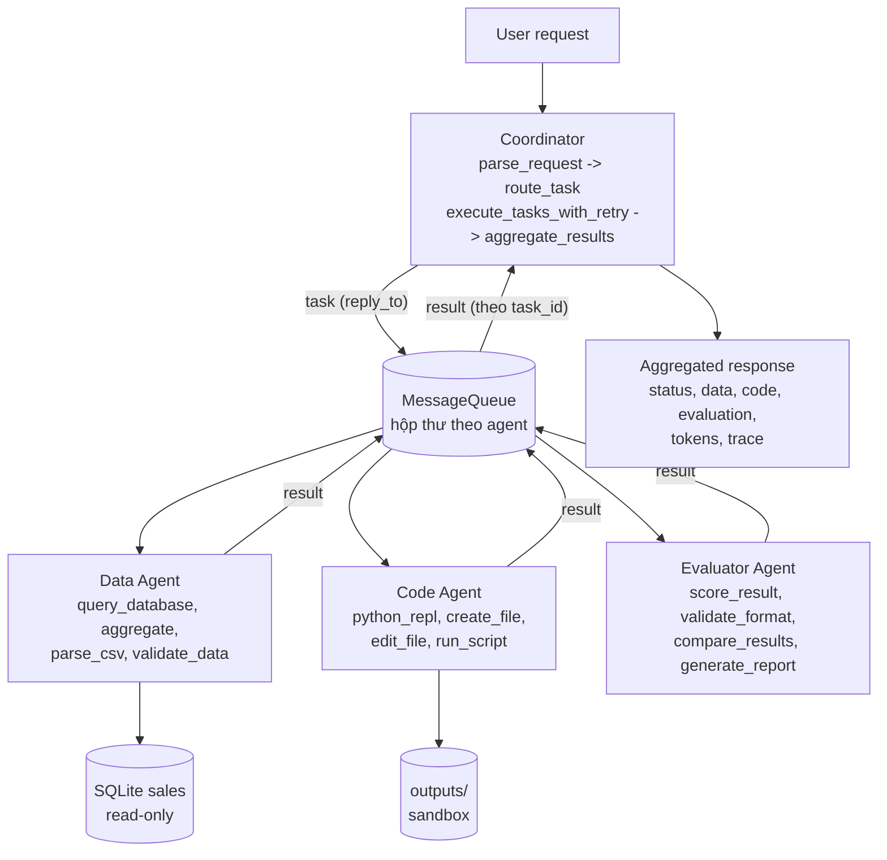

# Báo cáo: Hệ thống đa tác tử Coordinator–Workers

> Báo cáo theo hướng dẫn các Phần 1–6 (coordinator, worker, tool, test, benchmark). Báo cáo thí nghiệm của lab
> Deep Agents (baseline / subagents / skills-auto, theo `REPORT_TEMPLATE.md` và `RUBRIC.md`) nằm ở `report/REPORT.md`.

- Sinh viên: Nguy Khắc Phi Long, 2A202602532
- Mô hình: `openai:gpt-4.1-mini` (`LAB_MODEL`), `LAB_TEMPERATURE=0`; Python 3.11, macOS (chạy trực tiếp)
- Mã nguồn: `src/coordinator.py`, `src/agents/`, `src/communication/`, `src/tools/`, `src/system.py`;
  test: `tests_mas/`; script: `scripts_mas/`

## 1. Tổng quan bài lab

Hệ thống điều phối đa tác tử xử lý các yêu cầu phân tích doanh số cần nhiều tác tử chuyên môn phối hợp:

- **Coordinator (supervisor/router):** nhận yêu cầu, phân loại, định tuyến tới worker, chờ kết quả có timeout, retry/fallback, gộp kết quả.
- **Data Agent:** trả lời câu hỏi dữ liệu bằng SQL chỉ-đọc trên CSDL SQLite `sales` (600 đơn hàng năm 2026, sinh xác định bằng seed).
- **Code Agent:** viết và chạy mã Python (sandbox tiến trình con), tạo tệp (script, biểu đồ SVG).
- **Evaluator Agent:** chấm kết quả theo 4 tiêu chí có trọng số và đưa phản hồi dạng JSON.

Mục tiêu: hệ thống ổn định (không sập khi worker lỗi hoặc chậm), an toàn (SQL chỉ-đọc, sandbox, chặn path traversal, không lộ khóa API), đo được (log JSON, token, độ trễ) và kiểm thử được ngoại tuyến (mô hình giả, 0 token).

Phạm vi: một tiến trình, hàng đợi trong bộ nhớ, một mô hình LLM dùng chung cho mọi tác tử.

**Ba câu hỏi Phần 1.**

1. *Có bao nhiêu agent, mỗi agent làm gì?* Có 4 agent: Coordinator (điều phối, không có tool) và 3 worker (Data: 4 tool dữ liệu; Code: 4 tool mã/tệp; Evaluator: 4 tool chấm điểm). Mỗi worker có system prompt và bộ tool riêng theo chuyên môn.
2. *Coordinator giao tiếp với worker bằng cách nào?* Qua `MessageQueue` (asyncio, mỗi agent một hộp thư). Coordinator gửi thông điệp `task` kèm `reply_to` là một hộp thư trả lời riêng cho task (mẫu RPC). Worker nhận task, chạy vòng lặp LLM↔tool, rồi gửi thông điệp `result` về `reply_to`. Coordinator chờ có timeout, retry hoặc chuyển worker dự phòng nếu lỗi. Kết quả của giai đoạn trước được chuyển sang giai đoạn sau qua `parameters.previous_results` (handoff qua shared state).
3. *Tool nào được chia sẻ?* Tool không chia sẻ giữa các worker (nguyên tắc đặc quyền tối thiểu: Data Agent không chạy được mã, Code Agent không truy vấn được CSDL). Hạ tầng thì dùng chung: lớp `BaseTool` (validate → run → log, lỗi trả về dạng dữ liệu), `safe_path`, logger JSON, `MessageQueue`, bộ đếm token trong `BaseAgent`, và cùng một mô hình LLM.

## 2. Kiến trúc



**Luồng một yêu cầu** (ví dụ "Analyze Q3 revenue by region, create a chart and evaluate"):

```text
parse_request  -> task_types = [data_analysis, code_generation, evaluation], parameters = {quarter: 3}
route_task     -> data_agent, code_agent, evaluator_agent
stage 0 (song song trong giai đoạn): data_agent       -> "Q3 revenue: ..."   ┐ shared state
stage 1: code_agent (previous_results = data)          -> "chart.svg ..."    ┤ (handoff)
stage 2: evaluator_agent (previous_results = data+code)-> {"score": ..}      ┘
aggregate_results -> {status, data, code, evaluation, errors, tokens, trace, seconds}
```

Các worker trong cùng một giai đoạn chạy song song (`asyncio.gather`). Các giai đoạn chạy tuần tự vì có phụ thuộc dữ liệu: biểu đồ cần số liệu, đánh giá cần kết quả.

**Giao thức thông điệp** (mỗi thông điệp được gắn `from`, `to`, `id`, `timestamp` và ghi vào `logs/communication.log`):

```json
{"type": "task", "task_id": "data_agent-3f2a9c1d", "reply_to": "coordinator/data_agent-3f2a9c1d",
 "content": "User request: ...\nYour part: ...", "parameters": {"quarter": 3, "previous_results": {}},
 "from": "coordinator", "to": "data_agent", "id": "<uuid4>", "timestamp": "2026-10-06T..."}
{"type": "result", "task_id": "data_agent-3f2a9c1d",
 "result": {"status": "success|error|timeout", "worker": "data_agent", "type": "data", "result": "...",
            "metadata": {"tools_used": ["query_database"], "iterations": 2, "tokens": {...}, "seconds": 3.1}},
 "from": "data_agent", "to": "coordinator/data_agent-3f2a9c1d", "id": "<uuid4>", "timestamp": "..."}
```

**Guardrail:**

| Cơ chế | Giá trị | Vị trí |
|---|---|---|
| Số vòng lặp LLM↔tool tối đa của worker | 6 | `BaseWorker.max_iterations` |
| Timeout mỗi task | 120 s | `Coordinator.timeout` |
| Retry task lỗi/timeout | 1 lần | `Coordinator.max_retries` |
| Worker dự phòng | tùy cấu hình | `Coordinator.fallbacks` |
| Số task tối đa mỗi lô | 10 | `Coordinator.max_tasks` |
| Kích thước hộp thư | 100 | `MessageQueue.maxsize` |
| Độ dài yêu cầu tối đa | 5000 ký tự | `MAX_REQUEST_CHARS` |
| Timeout và giới hạn CPU của mã | 30 s | `PythonREPLTool`, `RunScriptTool` |
| Số dòng SQL tối đa / trả về cho LLM | 1000 / 100 | `QueryDatabaseTool` |
| Độ dài kết quả tool đưa lại cho LLM | 6000 ký tự | `BaseWorker.max_tool_output` |

<!-- Các mục 3-10 được bổ sung ở các phần sau -->
