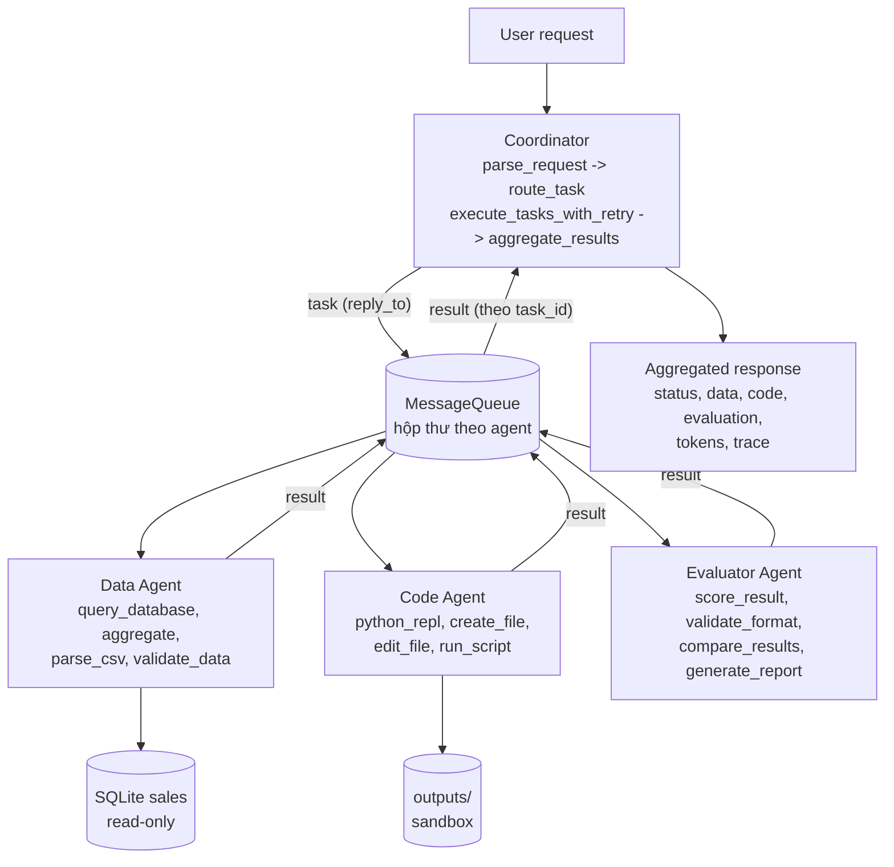

# Báo cáo: Hệ thống đa tác tử Coordinator–Workers

> Báo cáo theo hướng dẫn các Phần 1–6 (coordinator, worker, tool, test, benchmark). Báo cáo thí nghiệm của lab
> Deep Agents (baseline / subagents / skills-auto, theo `REPORT_TEMPLATE.md` và `RUBRIC.md`) nằm ở `report/REPORT.md`.

- Sinh viên: Nguy Khắc Phi Long, 2A202602532
- Mô hình: `openai:gpt-4.1-mini` (`LAB_MODEL`), `LAB_TEMPERATURE=0`; Python 3.11, macOS (chạy trực tiếp)
- Mã nguồn: `src/coordinator.py`, `src/agents/`, `src/communication/`, `src/tools/`, `src/system.py`;
  test: `tests_mas/`; script: `scripts_mas/`

## 1. Tổng quan bài lab

Hệ thống điều phối đa tác tử xử lý các yêu cầu phân tích doanh số cần nhiều tác tử chuyên môn phối hợp:

- **Coordinator (supervisor/router):** nhận yêu cầu, phân loại, định tuyến tới worker, chờ kết quả có timeout, retry/fallback, gộp kết quả.
- **Data Agent:** trả lời câu hỏi dữ liệu bằng SQL chỉ-đọc trên CSDL SQLite `sales` (600 đơn hàng năm 2026, sinh xác định bằng seed).
- **Code Agent:** viết và chạy mã Python (sandbox tiến trình con), tạo tệp (script, biểu đồ SVG).
- **Evaluator Agent:** chấm kết quả theo 4 tiêu chí có trọng số và đưa phản hồi dạng JSON.

Mục tiêu: hệ thống ổn định (không sập khi worker lỗi hoặc chậm), an toàn (SQL chỉ-đọc, sandbox, chặn path traversal, không lộ khóa API), đo được (log JSON, token, độ trễ) và kiểm thử được ngoại tuyến (mô hình giả, 0 token).

Phạm vi: một tiến trình, hàng đợi trong bộ nhớ, một mô hình LLM dùng chung cho mọi tác tử.

**Ba câu hỏi Phần 1.**

1. *Có bao nhiêu agent, mỗi agent làm gì?* Có 4 agent: Coordinator (điều phối, không có tool) và 3 worker (Data: 4 tool dữ liệu; Code: 4 tool mã/tệp; Evaluator: 4 tool chấm điểm). Mỗi worker có system prompt và bộ tool riêng theo chuyên môn.
2. *Coordinator giao tiếp với worker bằng cách nào?* Qua `MessageQueue` (asyncio, mỗi agent một hộp thư). Coordinator gửi thông điệp `task` kèm `reply_to` là một hộp thư trả lời riêng cho task (mẫu RPC). Worker nhận task, chạy vòng lặp LLM↔tool, rồi gửi thông điệp `result` về `reply_to`. Coordinator chờ có timeout, retry hoặc chuyển worker dự phòng nếu lỗi. Kết quả của giai đoạn trước được chuyển sang giai đoạn sau qua `parameters.previous_results` (handoff qua shared state).
3. *Tool nào được chia sẻ?* Tool không chia sẻ giữa các worker (nguyên tắc đặc quyền tối thiểu: Data Agent không chạy được mã, Code Agent không truy vấn được CSDL). Hạ tầng thì dùng chung: lớp `BaseTool` (validate → run → log, lỗi trả về dạng dữ liệu), `safe_path`, logger JSON, `MessageQueue`, bộ đếm token trong `BaseAgent`, và cùng một mô hình LLM.

## 2. Kiến trúc



**Luồng một yêu cầu** (ví dụ "Analyze Q3 revenue by region, create a chart and evaluate"):

```text
parse_request  -> task_types = [data_analysis, code_generation, evaluation], parameters = {quarter: 3}
route_task     -> data_agent, code_agent, evaluator_agent
stage 0 (song song trong giai đoạn): data_agent       -> "Q3 revenue: ..."   ┐ shared state
stage 1: code_agent (previous_results = data)          -> "chart.svg ..."    ┤ (handoff)
stage 2: evaluator_agent (previous_results = data+code)-> {"score": ..}      ┘
aggregate_results -> {status, data, code, evaluation, errors, tokens, trace, seconds}
```

Các worker trong cùng một giai đoạn chạy song song (`asyncio.gather`). Các giai đoạn chạy tuần tự vì có phụ thuộc dữ liệu: biểu đồ cần số liệu, đánh giá cần kết quả.

**Giao thức thông điệp** (mỗi thông điệp được gắn `from`, `to`, `id`, `timestamp` và ghi vào `logs/communication.log`):

```json
{"type": "task", "task_id": "data_agent-3f2a9c1d", "reply_to": "coordinator/data_agent-3f2a9c1d",
 "content": "User request: ...\nYour part: ...", "parameters": {"quarter": 3, "previous_results": {}},
 "from": "coordinator", "to": "data_agent", "id": "<uuid4>", "timestamp": "2026-10-06T..."}
{"type": "result", "task_id": "data_agent-3f2a9c1d",
 "result": {"status": "success|error|timeout", "worker": "data_agent", "type": "data", "result": "...",
            "metadata": {"tools_used": ["query_database"], "iterations": 2, "tokens": {...}, "seconds": 3.1}},
 "from": "data_agent", "to": "coordinator/data_agent-3f2a9c1d", "id": "<uuid4>", "timestamp": "..."}
```

**Guardrail:**

| Cơ chế | Giá trị | Vị trí |
|---|---|---|
| Số vòng lặp LLM↔tool tối đa của worker | 6 | `BaseWorker.max_iterations` |
| Timeout mỗi task | 120 s | `Coordinator.timeout` |
| Retry task lỗi/timeout | 1 lần | `Coordinator.max_retries` |
| Worker dự phòng | tùy cấu hình | `Coordinator.fallbacks` |
| Số task tối đa mỗi lô | 10 | `Coordinator.max_tasks` |
| Kích thước hộp thư | 100 | `MessageQueue.maxsize` |
| Độ dài yêu cầu tối đa | 5000 ký tự | `MAX_REQUEST_CHARS` |
| Timeout và giới hạn CPU của mã | 30 s | `PythonREPLTool`, `RunScriptTool` |
| Số dòng SQL tối đa / trả về cho LLM | 1000 / 100 | `QueryDatabaseTool` |
| Độ dài kết quả tool đưa lại cho LLM | 6000 ký tự | `BaseWorker.max_tool_output` |

## 3. Chi tiết cài đặt (quyết định và đánh đổi)

| # | Quyết định | Lý do | Đánh đổi |
|---|---|---|---|
| 1 | **asyncio + `asyncio.to_thread`** cho worker | Thời gian chủ yếu là chờ I/O (API LLM), nên các worker cùng giai đoạn chạy song song mà không cần đa tiến trình | Một thread bị timeout không hủy cưỡng bức được: nó chạy nốt và kết quả bị bỏ (vẫn tốn token) |
| 2 | **MessageQueue trong bộ nhớ** (`asyncio.Queue`) với **hộp thư `reply_to` riêng cho mỗi task** (mẫu RPC) | Đơn giản, đủ cho phạm vi lab. Phiên bản đầu dùng chung hộp thư coordinator thì `test_concurrent_requests` thất bại (5/10): các request song song "rút" mất reply của nhau | Không bền vững, chỉ trong một tiến trình |
| 3 | **Giai đoạn tuần tự data → code → evaluator** với handoff qua `previous_results` | Biểu đồ cần số liệu, đánh giá cần kết quả; truyền qua parameters để worker không phải tự đi tìm | Tổng độ trễ là tổng các giai đoạn; chỉ song song được trong cùng một giai đoạn |
| 4 | **`parse_request` theo luật từ khóa**, chỉ gọi LLM khi không khớp; cache theo câu đã chuẩn hóa | Coordinator là điểm nghẽn: luật mất 0 token và khoảng 0 ms; benchmark: 9/9 request phân loại bằng luật | Luật có thể phân loại sai câu lạ (ví dụ "report" luôn kéo theo Code Agent) |
| 5 | **Tool trả lỗi dạng dữ liệu** (`{"status": "error"}`), không ném | LLM đọc được lỗi và tự sửa ở vòng sau (Code Agent sửa script lỗi rồi chạy lại) | Phải đặt `max_iterations` để chặn vòng sửa lỗi vô hạn |
| 6 | **SQL ba lớp bảo vệ**: từ khóa (`\b`), một câu lệnh, mở SQLite `mode=ro`; bọc `SELECT * FROM (q) LIMIT n` | Lớp read-only vẫn chặn được thay đổi dữ liệu nếu lớp từ khóa bị vượt qua; regex `\b` tránh chặn nhầm cột như `updated_at` (cách `in` của hướng dẫn mẫu sẽ chặn nhầm) | Chỉ hỗ trợ SQLite |
| 7 | **Sandbox mã bằng tiến trình con** (`python -I`), env tối thiểu (không kế thừa khóa API), cwd = `outputs/`, timeout + giới hạn CPU, chặn import nguy hiểm | `exec()` trong tiến trình như hướng dẫn mẫu dùng chung bộ nhớ và môi trường (lộ `OPENAI_API_KEY`), không timeout được | Không giữ biến giữa các lần gọi; chưa phải cách ly mức hệ điều hành (nên dùng Docker) |
| 8 | **Một kết nối SQLite được cache** + `threading.Lock` | Không mở lại kết nối mỗi truy vấn; worker chạy trong thread pool | Truy vấn đồng thời bị tuần tự hóa |
| 9 | **Chỉ dùng thư viện chuẩn** (không pandas/matplotlib), biểu đồ bằng SVG | Không đổi `pyproject.toml` của lab | Code Agent phải tự viết SVG (v1); v2 thêm tool vẽ sẵn |
| 10 | **v2: Evaluator một lượt** (`single_pass=True`): 1 lần gọi LLM trả điểm từng tiêu chí; `ValidationTool` và `ScoringTool` chạy tất định trong code | Benchmark v1: Evaluator agentic là nút cổ chai (11–21 s, 4–10k token) | LLM không còn tự chọn tool; chế độ agentic vẫn giữ (`single_pass=False`) |
| 11 | **v2: tool `make_bar_chart_svg`** cho Code Agent | v1: Code Agent mất 3–5 vòng viết, chạy, sửa script vẽ SVG (tới 24 s, 13k token) | Thêm một tool; LLM vẫn có thể bỏ qua (xem mục 5) |
| 12 | **v2: cắt dữ liệu bàn giao** ở 1500 ký tự mỗi kết quả | Giảm input token của các giai đoạn sau | Giai đoạn sau có thể thiếu chi tiết nếu kết quả trước rất dài |
| 13 | **v3: "tool kết thúc"** (`BaseWorker.terminal_tools`; Code Agent: `make_bar_chart_svg`): nếu mọi tool call của một lượt thuộc tập này và đều thành công thì worker trả kết quả ngay, không gọi LLM thêm | v2: 18/18 lần Code Agent vẫn gọi `python_repl` sau khi vẽ xong, dù prompt đã dặn, nên **chỉ dặn trong prompt là không đủ** | Câu trả lời cuối là tóm tắt máy sinh từ kết quả tool (đường dẫn, số cột), không phải văn bản do LLM viết; tool lỗi thì LLM vẫn được thêm lượt để sửa |
| 14 | **v3: Data Agent trả lời ngắn** (tối đa 8 dòng, không mở đầu/kết luận) | Thời gian sinh output tăng theo độ dài (Data Agent trong luồng phức tạp 6–9 s ở v2) | Ít diễn giải hơn |

**Khó khăn đã gặp và cách xử lý (đều phát hiện bằng test):**

1. *Race reply giữa các request đồng thời:* chuyển sang hộp thư `reply_to` riêng cho mỗi task.
2. *`asyncio.Queue` gắn với event loop đầu tiên:* gọi `asyncio.run` nhiều lần làm lỗi. Đã thêm `_ensure_loop()` để tạo lại hộp thư (giữ thông điệp đang chờ) khi loop đổi.
3. *Giới hạn CPU sai trên macOS:* tiến trình con kế thừa thời gian CPU của tiến trình cha, nên giới hạn 3 s giết vòng lặp sau 0,15 s. Một script hợp lệ cũng có thể bị giết oan. Đã chuyển sang giới hạn tương đối (CPU đã dùng + 3 s), đo lại thì bị dừng sau 2,4 s.
4. *Tiến trình con bị giới hạn CPU giết không có trường `error`:* đã chuẩn hóa thông báo lỗi.
5. *Đếm token và `tools_used` sai khi chạy đồng thời* (phát hiện ở benchmark v2): `BaseWorker` lấy hiệu của bộ đếm dùng chung của instance, nên 10 request song song trên cùng Data Agent báo trung bình 9 749 token mỗi request (thực tế khoảng 1 270) và mỗi request liệt kê 10 lệnh `query_database`. Đã sửa: đếm theo từng task bằng biến cục bộ, bộ đếm tổng có `threading.Lock`. Có regression test `test_concurrent_tasks_on_one_worker_have_per_task_metrics`. Sau khi sửa: 1 290 token mỗi request.

## 4. Kết quả test

Tất cả chạy ngoại tuyến bằng mô hình giả `ScriptedChatModel` (0 token): `pytest tests_mas/ -v` cho **38/38 passed**. Bộ test của lab `pytest` (thư mục `tests/`) cho **32/32 passed**.

**Độ phủ mã** (`pytest-cov`, chỉ tiêu > 80%):

| Phạm vi | Lệnh | Độ phủ |
|---|---|---|
| Hệ đa tác tử (`src/coordinator.py`, `src/agents`, `src/communication`, `src/tools`, `src/system.py`, `src/base_agent.py`, `src/logger.py`) | `pytest tests_mas/ --cov=src.agents --cov=src.communication --cov=src.tools --cov=src.coordinator --cov=src.system --cov=src.base_agent --cov=src.logger` | **95%** (930 câu lệnh, thiếu 50) |
| Harness của lab (`src/lab`) | `pytest tests/ --cov=lab` | **90%** (359 câu lệnh, thiếu 35) |

| Tệp | Loại | Số test | Nội dung |
|---|---|---|---|
| `test_02_coordinator.py` | unit | 10/10 | init, parse (luật, tham số, ưu tiên, cache, chỉ gọi LLM khi luật không khớp), route, execute song song qua queue, aggregate (success/partial/error), timeout, retry, fallback, input không hợp lệ, vượt `max_tasks` |
| `test_03_workers.py` | unit + giao tiếp | 12/12 | Data/Code/Evaluator (single-pass và agentic), guardrail `max_iterations`, tool không tồn tại, mô hình lỗi, MessageQueue (gửi/nhận/log/timeout/chưa đăng ký/đầy/loop mới), `handle_next`, **đếm token/tool theo từng task khi 8 task chạy song song trên một worker**, tool kết thúc (dừng ngay khi vẽ xong; tool lỗi thì LLM được thêm lượt) |
| `test_04_tools.py` | unit | 8/8 | SQL (đúng giá trị; chặn DROP/DELETE/UPDATE/PRAGMA/đa câu lệnh; dữ liệu còn nguyên), REPL (chặn import, timeout, **không lộ khóa API**), path traversal, edit/run script, scoring, validation, comparison, report, aggregation, data quality, CSV, **biểu đồ SVG** (escape nhãn, validate input) |
| `test_05_integration.py` | integration + e2e | 8/8 | coordinator ↔ worker ↔ tool với handoff, pipeline đủ 3 giai đoạn + đếm token, kết quả partial, độ trễ, 10 request đồng thời, cắt dữ liệu bàn giao, khởi tạo hệ thống mặc định (tạo CSDL demo) |

| Kịch bản lỗi | Test | Kết quả |
|---|---|---|
| Worker treo 1 s, timeout 0,2 s | `test_worker_timeout_is_reported_not_raised` | `status=timeout`, không ném lỗi, `active_tasks` được dọn |
| Worker lỗi lần đầu | `test_worker_error_is_retried` | thành công ở lần 2 (`attempts=2`) |
| Worker ném ngoại lệ | `test_worker_exception_falls_back_to_other_worker` | chuyển sang worker dự phòng (`fallback_from`) |
| SQL injection `SELECT ...; DROP TABLE` | `test_query_database_tool` | bị chặn ("only one statement is allowed") |
| `../evil.txt`, `/etc/passwd` | `test_create_file_tool` | bị chặn, không có tệp nào ngoài sandbox |
| LLM lặp gọi tool mãi | `test_max_iterations_guardrail` | dừng sau 3 vòng, `status=error` |

**Script kiểm tra độc lập (0 token):**
- `scripts_mas/test_coordinator_standalone.py`: 3/3.
- `scripts_mas/test_tool_integration.py`: 3/3.

**Kiểm chứng với API thật:** `scripts_mas/test_resilience_real.py` cho 3/3, kết quả trong `results/multiagent/resilience_results.json` (chi tiết ở mục 6).

## 5. Phân tích hiệu suất

**Lệnh và phạm vi đo:**
- Lệnh: `python scripts_mas/benchmark.py --iterations 3 --rounds 3 --concurrency 10`. Kết quả v3 (hiện tại) ở `benchmark_results.json`; các bản trước ở `results/multiagent/benchmark_results_v2.json` và `results/multiagent/benchmark_results_v1.json` (v1 chỉ 1 lượt).
- Mô hình `gpt-4.1-mini`, nhiệt độ 0, 3 kịch bản × 3 lần × **3 lượt** = 27 request tuần tự, cộng 10 request đồng thời.
- Độ chính xác của Data Agent được chấm khách quan bằng cách so với giá trị SQL trực tiếp (sai số ≤ 0,5%).

**Kết quả v3 theo kịch bản** (27 request):

| Kịch bản | n | Min | Max | Avg | Median | P99 | Độ lệch chuẩn | Token TB | Thành công | Đúng số liệu | Điểm Evaluator TB |
|---|---|---|---|---|---|---|---|---|---|---|---|
| Simple data query | 9 | 1,99 s | 3,80 s | 2,47 s | 2,33 s | 3,71 s | 0,54 | 1 304 | 9/9 | 9/9 | – |
| Code generation | 9 | 4,45 s | 5,62 s | 4,90 s | 4,78 s | 5,60 s | 0,39 | 2 762 | 9/9 | – | – |
| Complex workflow | 9 | 5,33 s | 9,07 s | 6,30 s | 5,78 s | 8,98 s | 1,32 | 2 897 | 9/9 | 9/9 | 91,2 |

**Nhiễu giữa 3 lượt** (cùng mã v3):

| Lượt | P50 | P99 | Độ trễ TB | Token | Thành công |
|---|---|---|---|---|---|
| 1 | 4,80 s | 8,84 s | 4,95 s | 20 954 | 9/9 |
| 2 | 4,55 s | 7,82 s | 4,35 s | 21 600 | 9/9 |
| 3 | 5,06 s | 5,82 s | 4,36 s | 20 111 | 9/9 |

P50 tính trên cả 27 request là 4,78 s, nhưng một lượt đơn lẻ có thể vượt ngưỡng 5 s (lượt 3: 5,06 s). Ngưỡng này sát với độ trễ của kịch bản Code generation (median 4,78 s).

**Tiến trình tối ưu (v1 → v2 → v3):**

| Chỉ số | v1 (9 request) | v2 (27 request) | v3 (27 request) |
|---|---|---|---|
| Độ trễ P50 | 5,01 s | 4,70 s | 4,78 s |
| Độ trễ P99 | 50,76 s | 21,91 s | **8,79 s** |
| Độ trễ TB | 15,60 s | 7,99 s | 4,55 s |
| Complex workflow, TB | 38,97 s | 16,57 s | **6,30 s** |
| Complex workflow, token TB | 16 833 | 7 821 | 2 897 |
| Token / request | khoảng 6 800 | 3 901 | **2 321** |
| Thông lượng tuần tự | 3,85 req/phút | 7,51 req/phút | **13,17 req/phút** |
| Thông lượng đồng thời (10 request) | không đo | 170 req/phút | **207 req/phút** (2,9 s cả lô, P99 2,90 s, 1 327 token/request) |
| Đúng số liệu / tỉ lệ lỗi | 6/6; 0% | 18/18; 0% | 18/18; 0% |

**Phân rã complex workflow v3:**
- Data 2,2–5,5 s (2 lần chậm nhất có thêm một truy vấn).
- Code **1,2–1,9 s** (v2: 5,9–12,2 s), vì tool kết thúc bỏ hết các lượt LLM thừa.
- Evaluator 1,6–2,1 s.

**Thay đổi nào mang lại gì:**
1. *v1 → v2:* Evaluator một lượt (11–21 s xuống 1,6–2,2 s), tool vẽ SVG, cắt dữ liệu bàn giao.
2. *v2 → v3:* tool kết thúc (Code Agent 7–12 s xuống 1,2–1,9 s; token Code Agent trong luồng phức tạp 3–8k xuống 0,7–1,2k) và Data Agent trả lời ngắn.

**Profile:**
- *Mock, 0 token* (`scripts_mas/profile_system.py`): overhead coordinator + queue + log khoảng 3,5 ms/request.
- *Mô hình thật* (`--real`, 5 request, chạy trên v2, lưu ở `results/multiagent/profile_real.txt`): luồng chính chờ ở event loop 47,44/47,47 s; `coordinator.handle_request` tự tốn 0,007 s.
- *Giới hạn:* cProfile chỉ đo luồng chính, các worker chạy trong thread pool nên không hiện trong bảng.
- *Kết luận:* thời gian gần như hoàn toàn là chờ API LLM, nên tối ưu đúng chỗ là **giảm số lượt LLM**.

**Còn lại:** token trung bình 2 321/request (chỉ tiêu 1 500). Phân tích ở mục 7.

## 6. Phân tích lỗi và khả năng chống chịu

| Loại lỗi | Phát hiện | Xử lý | Dự phòng | Bằng chứng |
|---|---|---|---|---|
| Worker timeout | `asyncio.wait_for` quanh gửi + chờ reply | trả `status=timeout`, bỏ task chưa nhận khỏi hộp thư (`discard`), retry `max_retries` lần | `fallbacks`, nếu không có thì `partial` | unit test; **API thật**: timeout 0,5 s cho kết quả `timeout` sau 1,00 s (2 lần), `active_tasks` rỗng |
| Lỗi API (401, mạng, rate limit) | `BaseWorker.process` bắt mọi ngoại lệ thành `status=error` | retry, sau đó fallback | `partial` + `errors` | **API thật**: khóa giả cho `OpenAIAuthenticationError 401` ở cả 2 lần thử, chuyển sang `data_agent_backup` thành công sau 4,2 s, câu trả lời chứa đúng giá trị SQL 1100575.42 |
| Tool lỗi (SQL sai, script lỗi, tool không tồn tại) | `BaseTool.invoke` trả `{"status": "error"}` | LLM đọc lỗi và tự sửa ở vòng sau | `max_iterations` | `test_unknown_tool_and_model_errors_do_not_crash`, `test_max_iterations_guardrail` |
| Yêu cầu phá hoại | validate SQL (từ khóa, một câu lệnh), DB mở read-only | từ chối trước khi chạy | – | **API thật**: yêu cầu "delete every row ... then drop the table" thì LLM tự từ chối, không gọi tool (mô tả tool ghi rõ read-only); 600 dòng trước và sau. Bộ chặn SQL không phải can thiệp ở lần này, nó được kiểm chứng riêng bằng `test_query_database_tool` |
| Input không hợp lệ | `parse_request` | `InvalidRequestError`; `handle_request` trả `status=error` | – | `test_invalid_input_and_resource_exhaustion` |
| Cạn tài nguyên | `max_tasks`, hộp thư `maxsize` | `ResourceExhaustedError`, `QueueFullError` | – | như trên, `test_message_queue_full_and_new_event_loop` |
| Đồng thời trên cùng worker | – | đếm token/tool theo task, bộ đếm tổng có khóa | – | regression test; 10 request đồng thời 10/10 |

Benchmark v2 không gặp lỗi tự nhiên nào (0/27 + 0/10).

**Tự đánh giá: 7,5/10.**
- Retry, fallback và timeout đã được kiểm chứng với API thật.
- Vẫn thiếu circuit breaker và backoff khi gặp 429.
- Thread bị timeout vẫn chạy nốt và tốn token: ở kịch bản B, hai lần gọi API vẫn hoàn tất sau khi coordinator đã trả `timeout`.

## 7. So sánh thiết kế và thực tế

Chỉ tiêu "dự kiến" lấy từ bảng chỉ tiêu của hướng dẫn Phần 5.3.

| Khía cạnh | Dự kiến | v1 | v2 | v3 (hiện tại) | Đánh giá |
|---|---|---|---|---|---|
| Độ trễ P50 | < 5 s | 5,01 s | 4,70 s | **4,78 s** | Đạt (một lượt đơn lẻ có thể 5,06 s) |
| Độ trễ P99 | < 15 s | 50,8 s | 21,9 s | **8,79 s** | Đạt |
| Thông lượng | > 10 req/phút | 3,85 | 7,51; 170 đồng thời | **13,17 tuần tự; 207 đồng thời** | Đạt |
| Tỉ lệ lỗi | < 1% | 0% (0/9) | 0% (0/37) | **0%** (0/37) | Đạt |
| Token | 150k / 100 request | khoảng 680k / 100 | 390k / 100 | 232k / 100 | **Chưa đạt** (xem dưới) |
| Độ chính xác số liệu | – | 6/6 | 18/18 | **18/18** | Đạt |
| Độ phủ mã | > 80% | chưa đo | 95% | **95%** (hệ đa tác tử), 90% (lab) | Đạt |
| Test | toàn bộ đạt | 32/32 | 37/37 | **38/38** + 32/32 | Đạt |

**Vì sao chỉ tiêu token chưa đạt:** với kiến trúc 3 agent, mức thấp nhất đo được của luồng phức tạp đã là khoảng 2 600 token (Data khoảng 1 410, Code khoảng 690, Evaluator khoảng 460). Truy vấn đơn đã là 1 304. Kịch bản Code generation cần ít nhất 3 lượt LLM (tạo dữ liệu mẫu, viết script, chạy), mỗi lượt gửi lại system prompt và schema của 5 tool, nên tốn 2 762. Trung bình 1 500 token/request vì vậy chỉ đạt được nếu gộp các agent hoặc bỏ schema tool. Đó sẽ là đổi kiến trúc mà bài yêu cầu (coordinator + 3 worker). Truy vấn đơn (1 304 token, tức 130k / 100 request) đã nằm trong chỉ tiêu.

**Những gì tốt:**
- Mẫu `reply_to` loại bỏ race.
- Tool trả lỗi dạng dữ liệu giúp LLM tự sửa.
- Coordinator theo luật: 0 token, khoảng 3,5 ms.
- Đổi Evaluator sang một lượt giảm khoảng 90% thời gian của nó mà điểm đánh giá vẫn ổn định (95,8 trung bình).

**Những gì khó:**
- Ba lỗi chỉ lộ ra khi chạy đồng thời hoặc trên macOS (race reply, đếm token dùng chung, giới hạn CPU kế thừa).
- Không ép được LLM bỏ bước kiểm tra thừa chỉ bằng prompt.
- `asyncio` không hủy được thread.

**Bài học:**
1. Đo trước khi tối ưu. Benchmark v1 chỉ đúng vào Evaluator, sửa đúng chỗ đó cho hiệu quả lớn nhất.
2. Đo nhiều lượt: P50 lệch 0,9 s giữa các lượt.
3. Mọi số liệu theo task phải tính theo task, không lấy hiệu của bộ đếm chung.
4. Kiểm chứng số liệu bằng ground truth độc lập, không tin điểm của Evaluator (LLM chấm LLM).

## 8. Khả năng mở rộng

**Thêm worker (horizontal):**
- *Hiện tại:* 1 coordinator, 3 worker.
- *Đã đo:* coordinator xử lý đúng 10 request đồng thời trên cùng worker (170 req/phút, số liệu theo task đúng sau bản sửa).
- *Giới hạn:* coordinator là điểm lỗi duy nhất; `MessageQueue` chỉ trong một tiến trình; một kết nối SQLite có khóa.
- *Giải pháp:* broker ngoài (Redis Streams/RabbitMQ). Giao thức đã có `task_id`/`reply_to` nên đổi transport không cần đổi logic. Nhiều instance worker cùng đọc một hàng đợi. Coordinator không giữ trạng thái giữa các request ngoài cache phân loại.
- *Khả thi:* trung bình.

**Tác vụ lớn hơn (vertical):**
- *Giới hạn:* 1000 dòng SQL, 100 dòng trả cho LLM, kết quả tool 6000 ký tự, bàn giao 1500 ký tự.
- *Giải pháp:* đẩy tính toán xuống SQL hoặc script, phân trang, tóm tắt kết quả bàn giao.
- *Khả thi:* dễ.

**Thông lượng:**
- *Giới hạn:* độ trễ và rate limit của API.
- *Giải pháp:* chạy đồng thời (đã có), backoff khi gặp 429, cache câu trả lời, model nhỏ hơn cho Evaluator.
- *Khả thi:* dễ.

**Tự đánh giá: 6,5/10.**

## 9. Hạn chế

1. **Chỉ một tiến trình, hàng đợi không bền vững.** *Giảm thiểu:* broker ngoài có ack.
2. **Timeout không hủy được thread:** worker bị timeout vẫn chạy nốt và tốn token (đã thấy ở kịch bản B). *Giảm thiểu:* client LLM async có hỗ trợ cancel, hoặc chạy worker trong tiến trình con.
3. **Sandbox chưa cách ly mức hệ điều hành.** *Giảm thiểu:* Docker hoặc nsjail.
4. **Phân loại theo từ khóa dễ sai với câu lạ;** LLM fallback chỉ dùng khi không khớp luật nào.
5. **Benchmark vẫn nhỏ:** 3 kịch bản × 9 request, một mô hình, CSDL tổng hợp. Độ lệch chuẩn của complex workflow là 4,0 s.
6. **Evaluator là LLM chấm LLM:** điểm 95,8 không phải bằng chứng chất lượng. Chỉ số liệu được kiểm chứng khách quan (18/18).
7. **Chỉ tiêu 150k token / 100 request chưa đạt** (232k / 100). Mức sàn của luồng 3 agent khoảng 2 600 token (mục 7). P99 đã đạt ở v3 (8,79 s).
8. **cProfile không đo được thread worker;** phân tích thời gian của worker dựa trên log `task_end`.

## 10. Kết luận và bước tiếp theo

Hệ thống gồm 4 agent giao tiếp qua `MessageQueue` với mẫu `reply_to`, có timeout, retry, fallback, giới hạn vòng lặp và tool kết thúc. Kết quả đo được:
- 38/38 test ngoại tuyến, độ phủ 95%.
- Trên mô hình thật: 37/37 request thành công, 18/18 câu trả lời số liệu khớp ground truth.
- Retry, fallback và timeout hoạt động với lỗi API thật (401).

Qua ba vòng tối ưu, mỗi vòng nhắm đúng nút cổ chai đo được:
- P99 giảm từ 50,8 s xuống 8,79 s.
- Token mỗi request giảm từ khoảng 6 800 xuống 2 321.
- Thông lượng tuần tự tăng từ 3,85 lên 13,17 req/phút.

Hệ thống đạt 4/5 chỉ tiêu; chỉ tiêu token chưa đạt vì giới hạn của chính kiến trúc 3 agent. Bài học chính: những hành vi thừa của LLM phải được chặn **ở mức code** (Evaluator một lượt, tool kết thúc). Lời dặn trong prompt không thay đổi hành vi (18/18 lần vẫn gọi `python_repl`).

**Bước tiếp theo:**
1. *Ngắn hạn:*
   - Rút gọn schema tool và system prompt để hạ token.
   - Backoff khi gặp 429 và circuit breaker.
   - Cache kết quả cho câu hỏi dữ liệu lặp lại.
2. *Trung hạn:*
   - Redis Streams thay `asyncio.Queue`.
   - Worker chạy trong tiến trình riêng để hủy được khi timeout.
3. *Dài hạn:*
   - Sandbox Docker.
   - Dashboard từ `logs/*.log`.
   - Định tuyến động theo tỉ lệ thành công (6d).

## Phụ lục A: Thử thách mở rộng 6b - Worker fallback

- **Cài đặt:** `Coordinator(fallbacks={"data_agent": ["data_agent_backup"]})`. `execute_tasks_with_retry` thử lại task lỗi hoặc timeout `max_retries` lần, sau đó lần lượt chuyển sang các worker dự phòng. Kết quả thành công được đánh dấu `fallback_from`. Nếu mọi worker đều lỗi, coordinator trả `partial` hoặc `error` kèm `errors`, không ném ngoại lệ. Các worker nhận tham số `name`, nên tạo được bản dự phòng cùng loại.
- **Số liệu:**
  - *Mock:* worker treo 3 s, timeout 0,5 s, 2 lần timeout rồi fallback thành công (`test_coordinator_standalone.py` Test 3). Ngoại lệ 2 lần rồi fallback (`test_worker_exception_falls_back_to_other_worker`).
  - *API thật* (`test_resilience_real.py`, kịch bản A): worker chính nhận lỗi 401 ở cả 2 lần thử, chuyển sang `data_agent_backup` thành công trong 4,2 s, câu trả lời khớp ground truth 1100575.42.
- **Cơ chế:** retry và fallback dùng lại `execute_tasks`, nên mọi lần thử đều đi qua `MessageQueue`, có log `retry` / `fallback` trong `logs/coordinator.log` (bản chụp: `results/multiagent/logs/coordinator.log`).
- **Hạn chế:** fallback giữa các worker khác chuyên môn chỉ hợp lý khi worker dự phòng có tool phù hợp. Chưa có circuit breaker, nên worker lỗi liên tục vẫn bị thử ở mọi request.
- **Bước tiếp theo:** chọn worker dự phòng theo tỉ lệ thành công đo được (kết hợp 6d).

## Phụ lục B: Lệnh tái lập

```bash
pytest tests_mas/ -v                                                    # 38 passed (0 token)
pytest tests_mas/ --cov=src.agents --cov=src.communication --cov=src.tools \
       --cov=src.coordinator --cov=src.system --cov=src.base_agent --cov=src.logger   # 95%
python scripts_mas/test_coordinator_standalone.py                      # 3/3 (0 token)
python scripts_mas/test_tool_integration.py                            # 3/3 (0 token)
python scripts_mas/benchmark.py --iterations 3 --rounds 3 --concurrency 10   # benchmark_results.json
python scripts_mas/test_resilience_real.py                             # 3/3, results/multiagent/resilience_results.json
python scripts_mas/profile_system.py --real > results/multiagent/profile_real.txt
python scripts_mas/debug_system.py "Analyze Q3 2026 revenue by region and create an SVG bar chart" --evaluate
```

Ghi chú lịch sử commit (hai chuỗi "part 2–5"): xem `report/COMMIT_HISTORY.md`.

## Phụ lục C: Cấu trúc thư mục

Cấu trúc của lab (`README.md` mục 3) giữ nguyên. Các phần thêm theo hướng dẫn bổ sung được đặt **bên cạnh**, không sửa `tests/`, `scripts/`, `tasks/` hay các tệp có sẵn (`RUBRIC.md` trừ 10 điểm nếu sửa).

```text
<repo>/
├── README.md, GUIDE.md, RUBRIC.md, GLOSSARY.md, REPORT_TEMPLATE.md, pyproject.toml, .env.example, Dockerfile   (có sẵn)
├── guides/pseudocode/            (có sẵn)
├── tasks/                        (có sẵn, không sửa)
├── tests/                        (có sẵn, không sửa)   pytest -> 32 passed
├── scripts/                      (có sẵn, không sửa)   tour.py, verify_freeze.py, check_breakdown.py
├── src/
│   ├── lab/                      harness Deep Agents: agent.py, subagents.py, runner.py, curator.py (sinh viên cài) + tệp có sẵn
│   ├── coordinator.py            Coordinator (Phần 2)
│   ├── base_agent.py, logger.py, system.py
│   ├── agents/                   base_worker.py, data_agent.py, code_agent.py, evaluator_agent.py, mock_worker.py (Phần 3)
│   ├── communication/            message_queue.py (Phần 3)
│   └── tools/                    base_tool.py, database_tools.py, data_tools.py, code_tools.py, evaluation_tools.py (Phần 4)
├── tests_mas/                    test hệ đa tác tử (Phần 2-5): test_02_coordinator ... test_05_integration -> 38 passed
├── scripts_mas/                  script hệ đa tác tử: standalone, tool integration, debug, profile, benchmark, resilience
├── bonus_6c/                     thử thách mở rộng 6c của lab (red team curator) + test
├── skills/auto/                  3 skill do curator sinh (đóng băng ở tag `freeze`)
├── report/
│   ├── REPORT.md, table.md       báo cáo lab (chấm theo RUBRIC) + bảng của lab.compare
│   ├── MULTIAGENT_REPORT.md      báo cáo hệ đa tác tử (10 mục theo hướng dẫn Phần 6)
│   ├── COMMIT_HISTORY.md         ánh xạ commit -> phần
│   └── curator_runs/run1, run2/  skill của 2 lần curator bị thay thế (bằng chứng cho REPORT.md mục 6)
├── results/
│   ├── baseline/, subagents/, skills-auto/    6 tác vụ x run.json + trace.md (lab.compare đọc)
│   ├── skills-auto-dev/          kết quả Phần 3.4 trước đóng băng (sao lưu theo GUIDE 4.2)
│   ├── bonus-6c/                 dữ liệu, câu trả lời curator, skill của thí nghiệm 6c
│   └── multiagent/               benchmark v1/v2, kiểm chứng lỗi API thật, profile, bản chụp log
└── benchmark_results.json        benchmark v3 hiện tại (đường dẫn theo hướng dẫn Phần 5)
```

Không đưa vào git (`.gitignore`): `.env` (khóa API), `.venv/`, `logs/` (log sống; bản chụp ở `results/multiagent/logs/`), `outputs/` (tệp Code Agent sinh), `data/` (CSDL demo, tạo lại bằng `create_demo_db`), `.coverage`.

